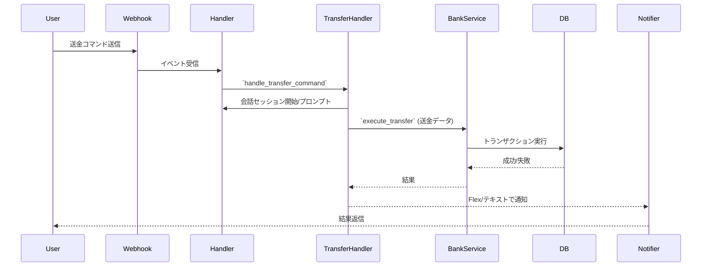

# サブシステム: Banking（銀行）

## 概要
`apps/banking` は口座作成、残高照会、入出金、送金などの金融ロジックを実装するサブシステムです。

## 主要責務
- ユーザー口座の作成/更新/削除
- 送金トランザクション（整合性とエラーハンドリング）
- 履歴の記録と参照

## 主要ファイル
- `apps/banking/account_creation.py` — 口座作成ロジック
- `apps/banking/bank_service.py` — ドメインロジック（残高計算、振替）
- `apps/banking/transfer_handler.py` — 送金フローのハンドラ
- `apps/banking/session_manager.py` — 会話ベースの状態管理
- `migrations/*` — 関連SQL（トランザクション/口座テーブル等）

## データフロー（送金の簡潔な例）
1. `transfer` コマンドを受け取る（`commands.py` → ハンドラ）
2. 必要情報を `session_manager` で収集（送金先、金額、認証）
3. `bank_service` でトランザクション処理を実行（DBトランザクション）
4. 成功/失敗をユーザーに通知し、ログを記録

## DB / マイグレーション
- 口座テーブル、トランザクション履歴テーブルが存在する想定。詳細は `migrations/` の関連SQLファイルを参照。

## エッジケースと考慮点
- 競合する送金の排他制御（トランザクション/ロック）
- 不正アクセス・認証チェック
- 小数点精度、通貨表現に注意

## 参照
- 関連コード: [apps/banking](../../apps/banking)

## 主要関数 / クラス
- `get_chip_balance(user_id: str)`
- `create_chip_account(user_id: str)`
- `purchase_chips(user_id: str, base_amount: int, bonus_amount: int, account_number: str, branch_code: str, price: Decimal)`
- `transfer_chips(from_user_id: str, to_user_id: str, amount: int)`
- `batch_lock_chips(locks: List[Dict])`
- `distribute_chips(distributions: Dict, game_session_id: str)`
- `redeem_chips(user_id: str, amount: int)`
- `get_chip_history(user_id: str, limit: int = 20)`
- `handle_transfer_command(event, user_id, sessions)`
- `handle_account_selection_postback(event, data, user_id, sessions)`
- `_start_transfer_session(event, user_id, sessions, from_account)`
- `handle_transfer_session_input(event, text, user_id, sessions)`
- `_handle_branch_code_input(event, text, user_id, sessions, transfer_data)`
- `_handle_account_number_input(event, text, user_id, sessions, transfer_data)`
- `_handle_amount_input(event, text, user_id, sessions, transfer_data)`
- `_handle_pin_input(event, text, user_id, sessions, transfer_data)`

## シーケンス図（送金）

