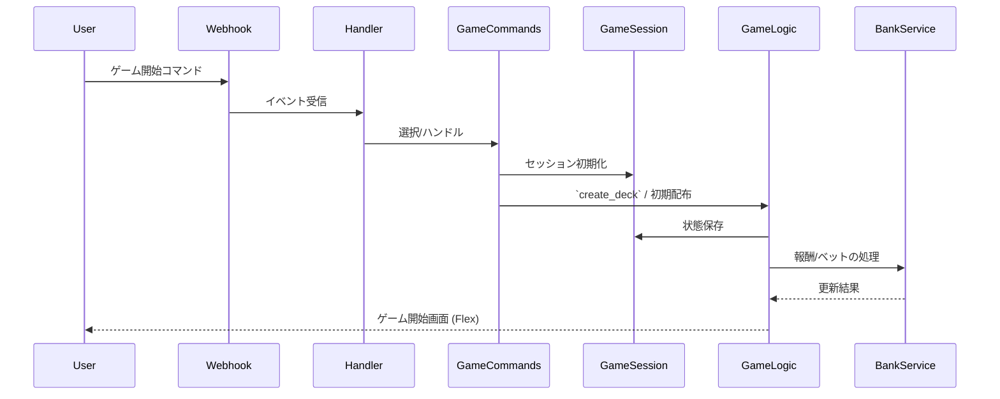

# サブシステム: Games（ミニゲーム）

## 概要
`apps/games` はブラックジャック、じゃんけん（RPS）、その他ミニゲームを実装し、ゲームセッションの管理と報酬処理を行います。

## 主要責務
- ゲームルールの実装と勝敗判定
- セッション単位の状態管理（`session_manager.py`）
- 報酬（チップ）付与やペナルティ処理

## 主要ファイル
- `apps/games/blackjack_game.py`, `blackjack_flex.py`
- `apps/games/rps_game.py`, `minigames.py`
- `apps/games/session_manager.py` — ゲーム固有の会話フロー管理

## データフロー（ブラックジャックの例）
1. ユーザーがゲーム開始コマンドを送信
2. `commands.py` がハンドルし `session_manager` を初期化
3. ゲームロジックでカード配布、プレイ、勝敗判定を行う
4. 結果に応じて報酬/損失を `banking` へ反映

## 注意点
- 不正操作防止（同一セッションの二重処理など）
- 状態の永続化（途中切断からの復帰）

## 参照
- 関連コード: [apps/games](../../apps/games)

## 主要関数 / クラス
- `create_deck() -> List[Dict]`
- `calculate_hand_value(hand: List[Dict]) -> int`
- `is_blackjack(hand: List[Dict]) -> bool`
- `is_bust(hand: List[Dict]) -> bool`
- `deal_initial_cards(deck: List[Dict]) -> Tuple[List[Dict], List[Dict], List[Dict]]`
- `hit_card(hand: List[Dict], deck: List[Dict]) -> Tuple[List[Dict], List[Dict]]`
- `dealer_play(dealer_hand: List[Dict], deck: List[Dict]) -> Tuple[List[Dict], List[Dict]]`
- `calculate_winner(player_hand: List[Dict], dealer_hand: List[Dict], ...)`
- `can_double_down(player_hand: List[Dict], chip_balance: int, bet_amount: int) -> bool`
- `process_double_down(player_hand: List[Dict], deck: List[Dict]) -> Tuple[List[Dict], List[Dict]]`
- `GameSessionManager` (セッション管理)

## シーケンス図（ゲーム開始）

