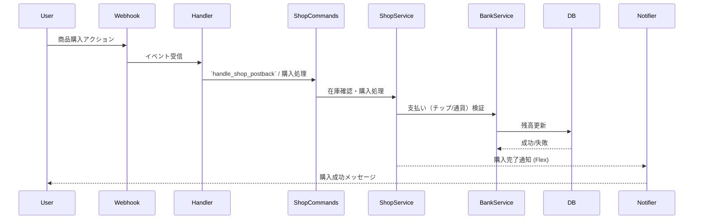

# サブシステム: Shop（ショップ）

## 概要
`apps/shop` は仮想商品の管理と購入フロー、在庫管理、購入履歴の保存を担当します。

## 主要責務
- 商品カタログの提供
- 購入処理（在庫確認、支払い、在庫減少）
- 購入履歴と注文処理

## 主要ファイル
- `apps/shop/shop_service.py` — 購入ロジック、在庫操作
- `apps/shop/shop_flex.py` — 商品表示用Flexテンプレート
- `apps/shop/session_manager.py` — 購入フローの状態管理

## データフロー（購入の例）
1. 商品選択 → カート作成
2. 支払い（チップ/通貨）確認 → `banking`/`chip` と連携
3. 在庫を減らし、領収/履歴を記録

## 注意点
- 在庫競合の制御（楽観ロック/悲観ロック）
- 価格変更時の古い注文処理の扱い

## 参照
- 関連コード: [apps/shop](../../apps/shop)

## 主要関数 / クラス
- `class ShopSessionManager`
- `handle_shop_command(user_id: str, db)`
- `handle_chip_balance_command(user_id: str, db)`
- `handle_chip_redeem_command(user_id: str, text: str, db)`
- `handle_chip_history_command(user_id: str, db)`
- `handle_shop_postback(user_id: str, data: dict, db, message_text: Optional[str] = None)`
- `handle_payment_registration_session(user_id: str, message_text: str, db)`
- `get_user_chip_balance(user_id: str, db) -> int`
- `handle_chip_exchange_all(user_id: str, db) -> TextSendMessage`
- `get_shop_home_carousel(categories: List[Dict]) -> FlexSendMessage`
- `get_category_items_flex(category_name: str, items: List[Dict]) -> FlexSendMessage`
- `get_purchase_success_flex(item_name: str, chips_received: int, new_base_balance: int, new_bonus_balance: int) -> FlexSendMessage`

## シーケンス図（購入）

